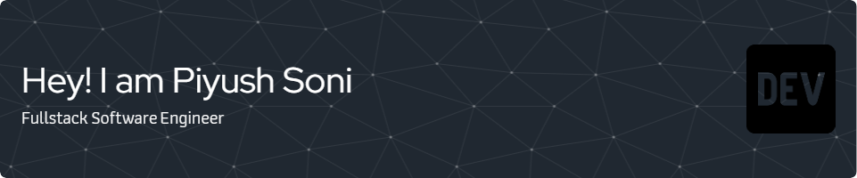

Welcome to my GitHub Page.🌟 🚀 As an experienced Software Engineer and adept Full Stack Developer, I specialize in Java and Angular, allowing me to handle a wide range of projects from front-end design to back-end development. I have a deep passion for designing and discussing intricate systems and excel in collaborative settings where I can share my knowledge and drive innovation. My commitment to delivering top-notch solutions and my enthusiasm for continuous learning make me an asset in developing reliable and efficient software. I am always eager to learn new technologies and collaborate with fellow technology enthusiasts. Let's connect and create something amazing together!

## My Core Expertise ⚙️

> Tools and technologies that I have worked upon.

<table>
  <tr>
   <td align="center" width="96">
        
       Javascript
    </td>
    <td align="center" width="96">
        
       Github
    </td>
    <td align="center" width="96">
        
       Java
    </td>
    <td align="center" width="96">
        
       Spring
    </td>
    <td align="center" width="96">
        
       Angular
    </td>
    <td align="center" width="96">
        
       React
    <td align="center" width="96">
        
       Rest API
    </td>
    <td align="center" width="96">
        
       Docker
    </td>

  <tr>
    <td align="center" width="96">
        
       Git
    </td>
    <td align="center"  width="96">
        
       GitLab
    </td>
    <td align="center"  width="96">
        
       HTML
    </td>
    <td align="center" width="96">
        
       CSS
    </td>
    <td align="center"  width="96">
        
       Bootstrap
    </td>
    <td align="center" width="96">
        
       Tailwind
    </td>
    <td align="center" width="96">
        
       PostgreSQL
    </td>
  </tr>
   
 <tr>
 </tr>
</table>

## Github stats 📊

  
GitHub Profile Stats 💻

   
    
  
   

  
Activity Graph 📈

   

  
Profile Views 👁️

   
  

